# <h1 align="center">**Mildew Detector**</h1>

## Introduction

The Mildew Detector dashboard application utilizes Machine Learning technology to allow users to upload images of cherry leaves for analysis. It assesses whether the cherry leaves is healthy or afflicted with powdery mildew, providing users with a downloadable report summarizing the findings.

### Deployed version at [Plant Disease Classification](https://mildew-detector-app-84798b6ec62b.herokuapp.com/)

## Table of Contents

- [Dataset Content](#dataset-content)
- [Business Requirements](#business-requirements)
- [Hypotheses and how to Validate](#hypotheses-and-how-to-validate)
- [Rational to Map Business Requirements](#the-rationale-to-map-the-business-requirements-to-the-data-visualisations-and-ml-tasks)
- [ML Business Case](#ml-business-case)
- [User Stories](#user-stories)
- [Dashboard Design](#dashboard-design---streamlit-app-user-interface)
- [Methodology](#methodology)
- [Rationale for the Model](#rationale-for-the-model)
- [Project Features](#project-features)
- [Project Outcomes](#project-outcomes)
- [Hypothesis Outcomes](#hypothesis-outcomes)
- [Testing](#testing)
- [Bugs](#bugs)
- [Deployment](#deployment)
- [Languages and Libraries](#languages-and-libraries)
- [Credits](#credits)

## Dataset Content
* The dataset is sourced from [Kaggle](https://www.kaggle.com/codeinstitute/cherry-leaves). Then created a fictitious user story where predictive analytics can be applied in a real project in the workplace.
* The dataset contains +4 thousand images taken from client's crop fields. The images show cherry leaves that are healthy and cherry leaves that contain powdery mildew, which is a fungal disease that affects a wide range of plants. The cherry plantation crop is one of their finest products in the portfolio and the company is concerned about supplying the market with a product of compromised quality.

## Business Requirements
- The cherry plantation crop from Farmy & Foods is facing a challenge where their cherry plantations have been presenting powdery mildew. Currently, the process is to manually verify if a given cherry tree contains powdery mildew. An employee spends around 30 minutes in each tree, taking a few samples of tree leaves and verifying visually if the leaf tree is healthy or has powdery mildew. If it has powdery mildew, the employee applies a specific compound to kill the fungus. The time spent applying this compound is 1 minute.  The company has thousands of cherry trees located in multiple farms across the country. As a result, this manual process is not scalable due to time spent in the manual process inspection.

- To save time in this process, the IT team suggested an ML system that is capable of detecting instantly, using a leaf tree image, if it is healthy or has powdery mildew. A similar manual process is in place for other crops for detecting pests, and if this initiative is successful, there is a realistic chance to replicate this project to all other crops. The dataset is a collection of cherry leaf images provided by Farmy & Foods, taken from their crops.

    * 1 - The client is interested in conducting a study to visually differentiate a cherry leaf that is healthy and that contains powdery mildew.
    * 2 - The client is interested to predict if a cherry leaf is healthy or contains powdery mildew.
    * 3 - The client would like to receive some treatment suggestions based on the plant disease.

## Hypothesis and how to validate?
1. The identification of cherry leaves affected by powdery mildew from healthy leaves can be achieved through visual examination of their distinct appearances.
   - This can be confirmed through the creation of an average image study and image montage, allowing for a comparative analysis of the appearance differences between healthy leaves and those affected by powdery mildew.
2. The determination of cherry leaves as healthy or afflicted with powdery mildew can be accomplished with a confidence level of 97% accuracy. 
   - This assertion can be substantiated by assessing the model's performance on the test dataset, aiming for a minimum accuracy rate of 97%.
3. The model's prediction accuracy may be compromised if the images of cherry leaves contain backgrounds different from the beige background of the Kaggle dataset. 
   - Confirm this limitation, the model should be tested with new pictures of cherry leaves featuring backgrounds distinct from those in the dataset images.
4. It is advisable to use images in RGB mode for improved prediction accuracy. Nevertheless, if images are not already in RGB mode, the trained model will automatically convert them to RGB mode for processing.
The outcome of the validation can be found on the live dashboard on the page "Project Hypotheses".

## The rationale to map the business requirements to the Data Visualizations and ML tasks
- Business Requirement 1: Data Visualization

  - The dashboard will showcase the 'mean' and 'standard deviation' images for both healthy and powdery mildew-infected cherry leaves.
  - Additionally, it will display the contrast between an average healthy leaf and an average leaf infected with powdery mildew.
  - Furthermore, an image montage featuring healthy leaves, leaves affected by powdery mildew will be presented for comparison.

- Business Requirement 2: Classification

  - Create and fit a machine learning model to predict if a given leaf is healthy or infected with powdery mildew. This will be a classification task with three classes and will require to set the image shape.
  - The model provides treatment recommendations to users based on the type of plant disease identified.
  - The predictions should have a 97% accuracy level.
  
- Business Requirement 3: Report
  - A downloadable report containing the predicted status of all uploaded images is available for users.

## ML Business Case
- To create a machine learning model for cherry leaf classification, particularly distinguishing between healthy leaves and those infected with powdery mildew, typically the following steps are followed:

1. Data Collection: Gather a dataset containing images of leaves categorized as healthy and powdery mildew-infected. Ensure each category is well-represented in the dataset.

2. Data Preprocessing: Preprocess the images to ensure uniformity in size, color space, and quality. This step may involve resizing, normalization, and augmentation techniques to enhance the dataset's diversity.

3. Feature Extraction: Use techniques like convolutional neural networks (CNNs) to extract meaningful features from the images. CNNs are particularly effective for image classification tasks due to their ability to capture spatial hierarchies.

4. Model Selection: Choose an appropriate machine learning model architecture for classification. Common choices for image classification tasks include CNN-based architectures.

5. Model Training: Split the dataset into training and validation sets. Train the selected model on the training set while validating its performance on the validation set. Fine-tune hyperparameters to optimize the model's performance.

6. Model Evaluation: Evaluate the trained model's performance using appropriate evaluation metrics on the validation set.

7. Model Testing: Once satisfied with the model's performance, test it on a separate test dataset to assess its generalization ability. This step ensures that the model can accurately classify unseen data.

8. Deployment: Deploy the trained model into production, making it available for inference on new leaf images. Integrate the model into an application or system where users can upload leaf images and receive predictions on their health status.

9. Monitoring and Maintenance: Continuously monitor the model's performance in production and update it periodically with new data to ensure its effectiveness over time.

- The training data is a [Kaggle dataset](https://www.kaggle.com/codeinstitute/cherry-leaves) with over 4k images of healthy and affected cherry leaves. 

## User Stories

- As a client I require an intuitive dashboard for easy navigation, allowing me to effortlessly access and comprehend data, models, and outcomes.
- As a client I need the capability to observe average and variable images of both healthy cherry leaves and those infected with powdery mildew. This feature will enable me to visually distinguish between the two categories.
- As a client I seek the ability to view a visual montage comprising images of healthy cherry leaves and those infected with powdery mildew. This feature will facilitate a clearer differentiation between the three classifications.
- As a client I desire the functionality to upload images of cherry leaves and receive classification predictions with an accuracy exceeding 97%. This will allow for swift assessment of cherry tree health based on the provided predictions.
- As a client I require treatment suggestions based on identified plant diseases to effectively address any issues affecting my plants' health.
- As a client I require the facility to download a report containing the provided predictions, ensuring that I have a record of the outcomes for future reference.

## Dashboard Design
### Page 1: Quick Project Summary

- Provide an overview of powdery mildew, accompanied by sample images for illustration.
- Outline the specifics of the dataset utilized in the project.
- Define the business requirements.
- Include a hyperlink to access this Readme file.

### Page 2: Plant leaves Visualizer

- This page is designed to meet Business Requirement 1 by showcasing the following:
  - Illustrating the disparity between the average and variability image.
  - Displaying the contrast between average healthy leaves and leaves infected with powdery mildew.
  - Presenting an image montage featuring for healthy leaves and leaves infected with powdery mildew.

### Page 3: Plant Diseases Detector

- This page is designed to meet Business Requirements 2 and 3, offering the following features:
  - Prediction of whether a leaf is infected with powdery mildew.
  - Provision of a link to download a set of images displaying healthy leaves and leaves infected with powdery mildew for live prediction.
  - User Interface featuring a file uploader widget for multiple leaf image uploads. It displays each uploaded image along with a prediction statement indicating if the leaf is infected with powdery mildew, along with the associated probability.
  - Generation of a report containing image names and prediction results.
  - Offering treatment recommendations and additional recourses tailored to plant disease.
  - Download button provided to download the generated report.

### Page 4: Project Hypothesis and Validation

- Detail each [hypotheses](#hypotheses-and-how-to-validate), how it was validated and the conclusion.

### Page 5: Machine Learning Performance Metrics

- Providing comprehensive details on the model performance, including:
  - Label frequencies for the training, validation, and test sets.
  - Model history depicting accuracy and losses during training.
  - Evaluation results of the model's performance.
  - Offering metrics that demonstrate the performance of the model.

## Methodology

### CRISP-DM

CRISP-DM methodology was employed for the data mining project, consisting of six stages with the following interrelated relationship:

1. **Business Understanding**: In this initial phase, the focus was on understanding the business objectives, requirements, and priorities. Key stakeholders were engaged to define the scope of the project and establish clear goals for data mining efforts.

2. **Data Understanding**: Once the business goals were clarified, attention turned to understanding the available data sources. This involved identifying relevant datasets, assessing their quality, and gaining insights into the nature of the data.

3. **Data Preparation**: With a comprehensive understanding of the data at hand, efforts were directed towards preparing the data for analysis. This stage involved data cleaning, integration, transformation, and formatting to ensure that it was suitable for modeling.

4. **Modeling**: The modeling phase involved selecting appropriate techniques and algorithms to build predictive or descriptive models based on the prepared data. Various modeling techniques were explored, including machine learning algorithms, and data visualization methods.

5. **Evaluation**: Once the models were developed, they were evaluated to assess their performance and effectiveness in meeting the business objectives. This involved testing the models against validation datasets and using metrics to measure their accuracy, precision, recall, and other relevant criteria.

6. **Deployment**: The final stage of the CRISP-DM process involved deploying the models into production environments. This required integrating the models with existing systems, implementing monitoring mechanisms, and providing support for ongoing maintenance and updates.

Throughout each stage of the process, there was a continuous feedback loop, allowing for adjustments and refinements based on new insights and changing requirements. This iterative approach ensured that the data mining project remained aligned with the business objectives and delivered actionable results.

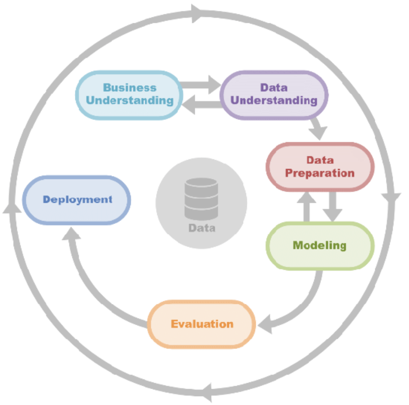

### Agile

For the project, an agile approach was adopted, facilitated by GitHub projects with the assistance of Milestones and Issues. Each Issue comprehensively outlined the relevant tasks to be completed.

The project board can be viewed [here](https://github.com/users/FeruzaShokirjonovna/projects/7/views/1)

### Image preparation

The original images [Kaggle](https://www.kaggle.com/datasets/codeinstitute/cherry-leaves) possess a large size and resolution. To address this, we utilize the PIL package to resize and adjust the images, reducing their dimensions to (50, 50, 3).

## Rationale for the Model
- The rationale behind selecting a specific model for a machine learning task is typically based on several factors:

  - A good model excels in generating accurate predictions by effectively generalizing from the training data, thus enabling precise predictions on unseen data. Additionally, it maintains simplicity, avoiding unnecessary complexity in neural network architecture or computational power.

  - However, when a model undergoes excessive training or becomes overly complex, it risks learning noise or irrelevant information from the dataset. This phenomenon, known as overfitting, results in the model fitting too closely to the training set, leading to poor generalization on new data. Overfitting can be identified by assessing the model's performance on validation and test datasets.

  - Conversely, underfitting occurs when the model fails to discern meaningful relationships between input and output data. Detection of underfitting involves evaluating the model's performance on the training dataset, typically indicated by low accuracy. This deficiency also translates to low accuracy across validation and test datasets.

### Model Creation

- For this image classification project, a Convolutional Neural Network (CNN) is implemented using TensorFlow. The task involves classifying images into one of three categories: healthy, powdery mildew-infected, or rust-infected. Here's a breakdown of the model:

  - The model is initiated using the Sequential() function, indicating a sequential layer-by-layer architecture.

  - Four convolutional layers (Conv2D) are added successively to extract features from input images. Each convolutional layer has a 3x3 filter size and employs the Rectified Linear Unit (ReLU) activation function to introduce non-linearity. The first layer specifies an input shape of (IMG_HEIGHT, IMG_WIDTH, IMG_CHANNELS).

  - After each convolutional layer, a max-pooling layer (MaxPooling2D) with a 2x2 window size is added to downsample the feature maps, retaining the most salient features.

  - Following the convolutional and max-pooling layers, a Flatten() layer is included to flatten the feature maps into a one-dimensional vector, preparing them for input to the dense layers.

  - Two fully connected (Dense) layers are added with 128 units each, employing ReLU activation functions. These layers serve as intermediate layers for feature transformation and extraction.

  - The final dense layer consists of 2 units, representing the number of classes (healthy, powdery_mildew) in the classification task. 

The model architecture was iteratively refined through trial and error, aiming to address issues such as underfitting or overfitting observed in previous versions. The chosen model version, referred to as version 1 in the evaluation phase, demonstrated a balanced fit.

BDetailed insights into the testing phase can be found in the [testing section](#testing).

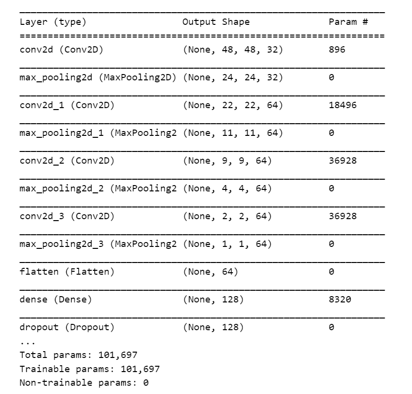

## Project Features

Navigation

The navigation bar remains visible across all pages of the dashboard, offering convenient access to various sections.

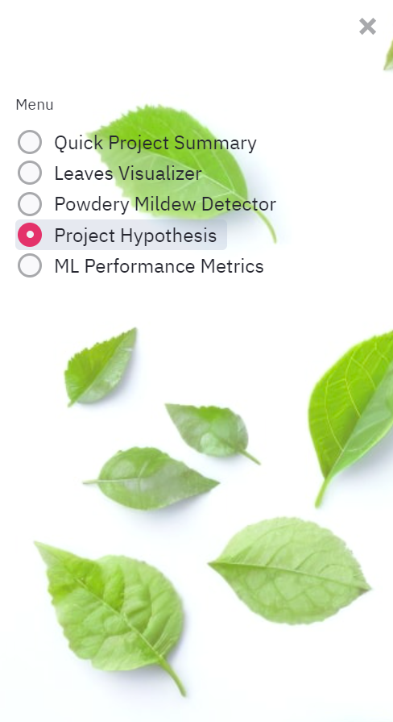

Page 1: Quick Project Summary

The Quick Project Summary page furnishes users with details regarding powdery mildew, a project summary, dataset information, and the business requirements. Additionally, a hyperlink to access this ReadMe file is provided.

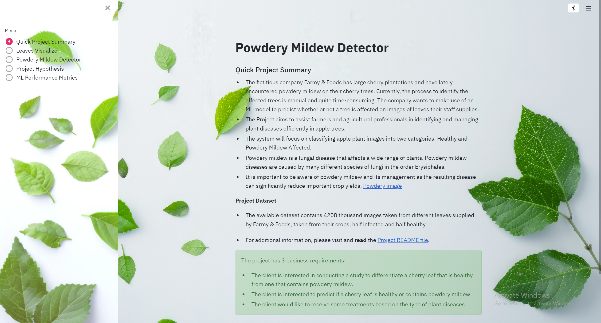

Page 2: Plant image Visualizer

The leaf visualizer page presents users with the outcomes of the study, aiding in visually distinguishing between a healthy cherry leaf and one affected by powdery mildew. It was established that healthy and infected leaves exhibit discernible differences in appearance.

On this page, users have the options to:

  - View the disparity between average and variability images.
  - Compare the distinctions between average infected and average uninfected leaves.
  - Access an image montage showcasing healthy or infected leaves.

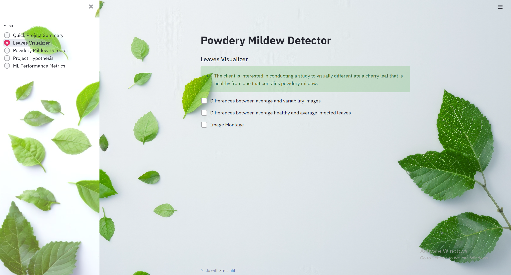
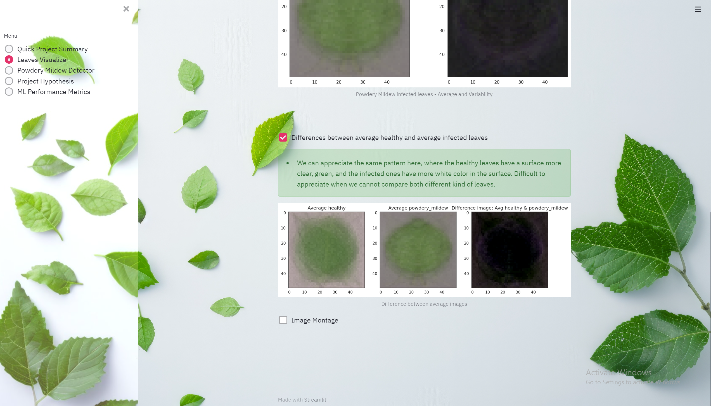

Page 3: Plant Disease Detector

On the detector page, users have the capability to upload images of cherry leaves to determine their health status, whether they are healthy or infected with powdery mildew. Following the upload, each image is accompanied by a prediction statement and a graphical representation depicting the probability of the prediction's accuracy. Moreover, treatment suggestions and additional recources tailored to the respective plant diseases are provided for user reference. Finally, a downloadable report is available, offering comprehensive details including the image name, probability accuracy, result in a .csv format.

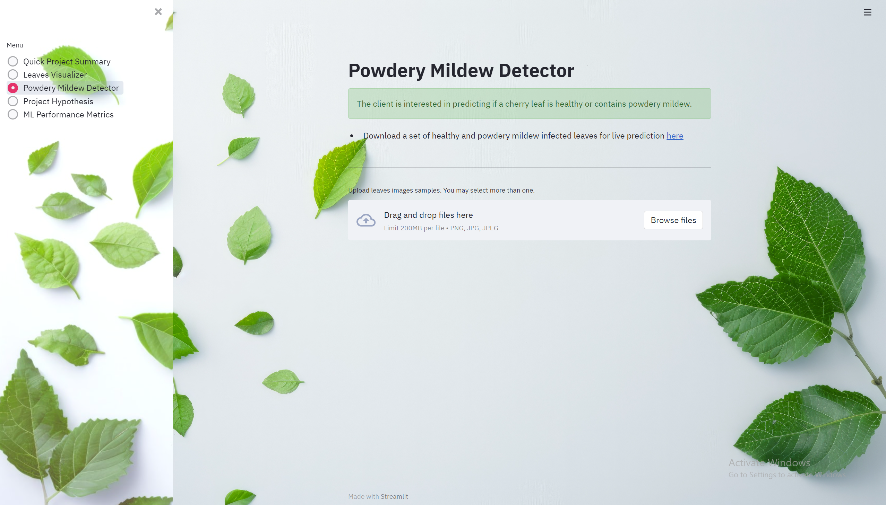
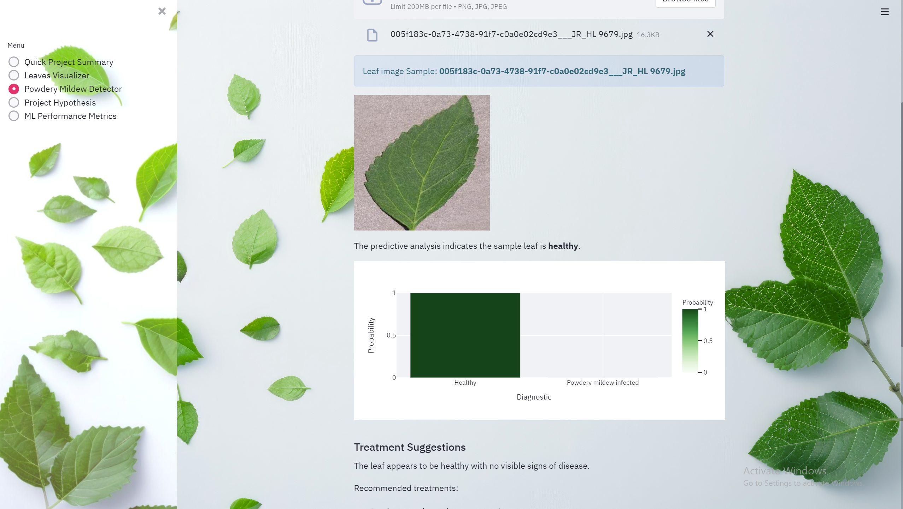

Page 4: Project Hypothesis and Validation

The hypothesis page furnishes users with comprehensive details regarding the project hypotheses and their respective outcomes.

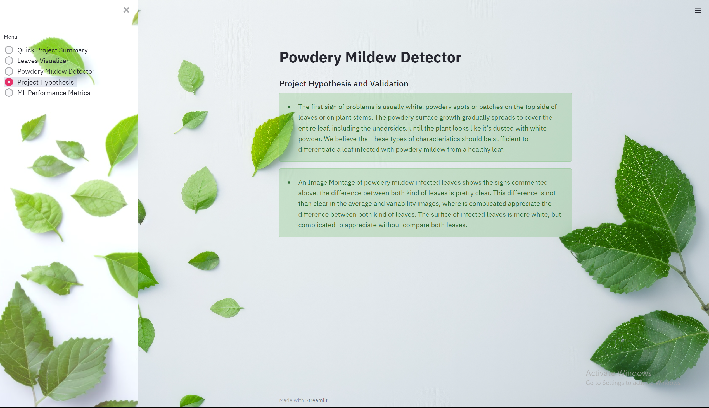

Page 5: Machine Learning Performance

The performance metrics page offers users insights into various aspects of the machine learning model's performance, including:

1. Dataset distribution: Visual representation of the distribution of the dataset used for training, validation, and testing.

2. Performance plots: Graphical representations illustrating the performance metrics during model training and evaluation.

3.  Performance on the test dataset: Summary of the model's performance metrics specifically on the test dataset.

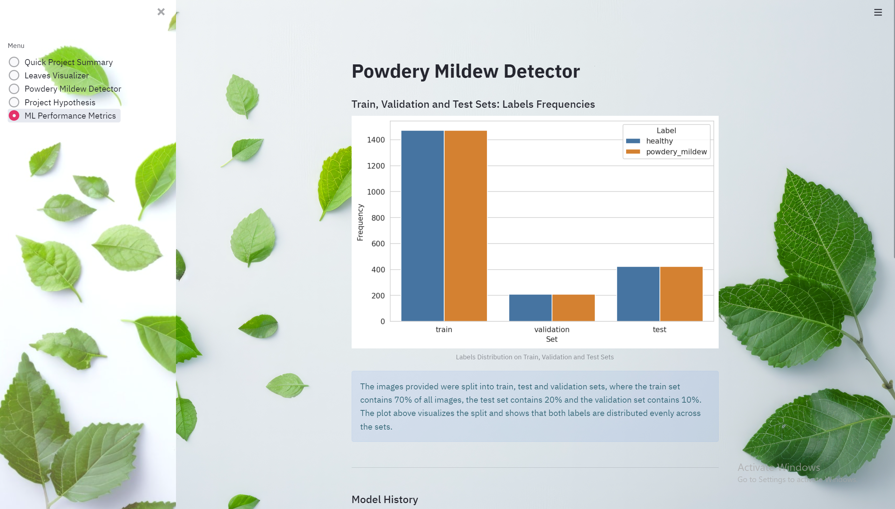
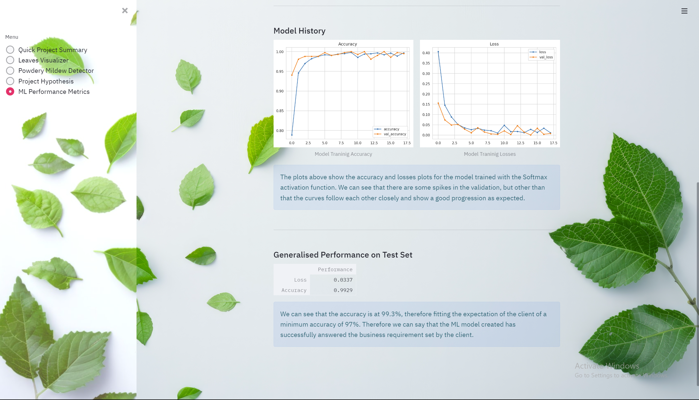

## Project Outcomes

### Business Requirement 1: Data Visualization

The visualization study can be accessed via the [Plant image Visualizer page](https://mildew-detector-app-84798b6ec62b.herokuapp.com/) on the dashboard. This study showcases the mean and variability images alongside an image montage featuring both healthy and infected leaves. The study concludes that distinguishing between healthy and infected leaves is possible based on appearance.

### Business Requirement 2: Classification

- The classification tool is accessible on the [Plant Disease Detector page](https://mildew-detector-app-84798b6ec62b.herokuapp.com/) of the dashboard. Users can upload images of cherry leaves and receive a classification prediction for each image, accompanied. Notably, the predictions boast an accuracy level exceeding 97%.
- The prediction is accompanied by suggestions for plant diseases.

### Business Requirement 3: Report

The report is accessible on the [Plant Disease Detector page](https://mildew-detector-app-84798b6ec62b.herokuapp.com/) of the dashboard following the classification of images. Users are presented with a table displaying the image name, probability percentage, corresponding treatment suggestions and result for each uploaded image. Additionally, users can download the report by clicking 'Download Report', saving it as a .csv file.

## Hypothesis Outcomes

### Hypothesis 1

- The hypothesis that cherry leaves with powdery mildew can be differentiated from healthy leaves by their appearance was confirmed through various visual analyses.

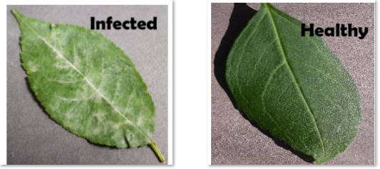

An average image study and image montage were conducted to discern disparities between healthy leaves and those affected by powdery mildew. The image montage vividly illustrated that leaves infected with powdery mildew are distinguishable due to the presence of white deposits on the affected leaves. 

Furthermore, the average and variability images revealed distinctive patterns, particularly within the center of the leaf, relating to color pigmentation. Notably, the variability images showcased a discernible difference wherein the center of healthy leaves appeared black, whereas the center of infected leaves did not exhibit the same characteristic.

In conclusion, the hypothesis was validated, confirming that healthy leaves and infected leaves can indeed be distinguished by their appearance. Leaves affected with powdery mildew exhibit distinctive white marks.

### Hypothesis 2

- Cherry leaves can be accurately classified as healthy or infected with powdery mildew with a remarkable degree of over 97% accuracy.

This assertion was substantiated by evaluating the model's performance on the test dataset.

The model exhibited outstanding accuracy during training, surpassing 97% with both the train and validation datasets. Furthermore, it achieved a remarkable 99% accuracy on the test dataset.

In conclusion, this hypothesis was verified as the model, trained using a Convolutional Neural Network, successfully classified images of cherry leaves as healthy or infected with powdery mildew with an accuracy exceeding 97%.

### Hypothesis 3

- If the image contains a background that differs from the background of the Kaggle dataset, the model may produce inaccurate predictions.

This assertion was confirmed through the uploading of the following images to the dashboard:

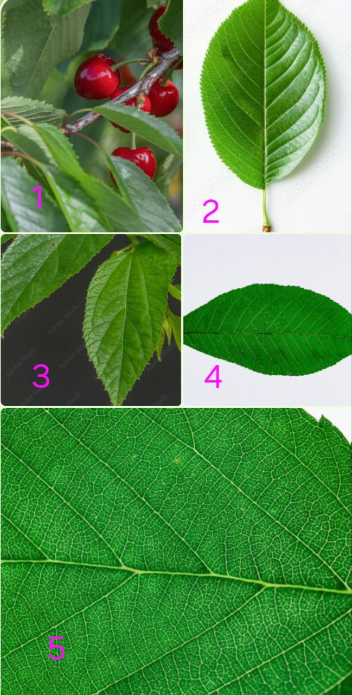

The results were 2 correct predictions and 3 incorrect predictions as follows:

| Image Numbers | Classification |
|---------------|----------------|
| 1             | Infected        |
| 2             | Healthy        |
| 3             | Infected        |
| 4             | Healthy           |
| 5             | Infected           |

This insight will be conveyed to the client to ensure they understand the significance of adhering to the image background requirements for optimal model performance.

In conclusion, this hypothesis was validated as the model inaccurately predicted the classification of 2 out of 5 images.

## Testing

User Story Testing

**Business Requirement 1: Data Visualization**

1. **Interactive Dashboard Navigation:**
   - **User Story:** Client needs easy navigation within the interactive dashboard for effective data comprehension.
   - **Test Scenario:**
     | Feature           | Action                           | Expected Outcome                         | Actual Outcome |
     | ----------------- | -------------------------------- | ---------------------------------------- | -------------- |
     | Navigation bar    | Clicking on side menu buttons    | Correct display of selected page content | Functions as intended |

2. **Plant Image Visualizer Page:**
   - **User Story:** Clients require visual representation of average images, image disparities, and variations between healthy and diseased cherry leaves for quick identification.
   - **Test Scenarios:**
     | Feature                                | Action                            | Expected Outcome                      | Actual Outcome |
     | -------------------------------------- | --------------------------------- | ------------------------------------- | -------------- |
     | Checkbox for average and variability images | Checking the checkbox          | Rendering of relevant image plots     | Functions as intended |
     | Checkbox for difference between average images | Checking the checkbox       | Rendering of relevant image plots     | Functions as intended |
     | Checkbox for image montage            | Checking the checkbox           | Display of label selection dropdown and "Create montage" button | Functions as intended |
     | Image montage creation button         | Clicking 'Create Montage' button after label selection | Display of relevant image montage with correct label | Functions as intended |

**Business Requirement 2 and 3: Classification and Providing recommendations**

1. **Plant Disease Detector Page:**
   - **User Story:** Clients aim to upload cherry leaf images to utilize the ML model for immediate and accurate disease prediction.
   - **Test Scenario:**
     | Feature            | Action                                          | Expected Outcome                            | Actual Outcome |
     | ------------------ | ----------------------------------------------- | ------------------------------------------- | -------------- |
     | File uploader      | Uploading image data via 'Browse files' button | Display of disease prediction with probabilities and suggest treatments | Functions as intended |

2. **Saving Model Predictions:**
   - **User Story:** Clients need to save model predictions in a CSV file.
   - **Test Scenario:**
     | Feature                  | Action                                          | Expected Outcome                            | Actual Outcome |
     | ------------------------ | ----------------------------------------------- | ------------------------------------------- | -------------- |
     | Download Report link     | Clicking on 'Download Analysis Report as CSV' link | Saving of a CSV file              | Functions as intended |

Dashboard Testing

| Page         |          Feature          | Pass / Fail |
| ------------ | :-----------------------: | :---------: |
| Quick Project Summary |          Content          |    Pass     |
| Quick Project Summary |         Nav link          |    Pass     |
| Quick Project Summary |        ReadMe link        |    Pass     |
| Plant Visualizer   |          Content          |    Pass     |
| Plant Visualizer   |    1st checkbox ticked    |    Pass     |
| Plant Visualizer   |   1st checkbox unticked   |    Pass     |
| Plant Visualizer   |    2nd checkbox ticked    |    Pass     |
| Plant Visualizer   |   2nd checkbox unticked   |    Pass     |
| Plant Visualizer   |    3rd checkbox ticked    |    Pass     |
| Plant Visualizer   |   3rd checkbox unticked   |    Pass     |
| Plant Visualizer   |      Healthy montage      |    Pass     |
| Plant Visualiser   |  Powdery Infected montage |    Pass     |
| Plant Detector     |          Content          |    Pass     |
| Plant Detector     |        Kaggle link        |    Pass     |
| Plant Detector     |       Dropdown menu       |    Pass     |
| Plant Detector     |    Browse file upload     |    Pass     |
| Plant Detector     |   Show uploaded images    |    Pass     |
| Plant Detector     |     Show predictions      |    Pass     |
| Plant Detector     |  Show probability graph   |    Pass     |
| Plant Detector     |     Suggest treatment     |    Pass     |
| Plant Detector     |      Analysis report      |    Pass     |
| Plant Detector     |    Downloadable report    |    Pass     |
| Project Hypothesis   |          Content          |    Pass     |
| Machine Learning Performance  |          Content          |    Pass     |

## Unfixed Bugs
* You will need to mention unfixed bugs and why they were not fixed. This section should include shortcomings of the frameworks or technologies used. Although time can be a significant variable to consider, paucity of time and difficulty understanding implementation is not a valid reason to leave bugs unfixed.

## Deployment
### Heroku

* The App live link is: https://YOUR_APP_NAME.herokuapp.com/ 
* Set the runtime.txt Python version to a [Heroku-20](https://devcenter.heroku.com/articles/python-support#supported-runtimes) stack currently supported version.
* The project was deployed to Heroku using the following steps.

1. Log in to Heroku and create an App
2. At the Deploy tab, select GitHub as the deployment method.
3. Select your repository name and click Search. Once it is found, click Connect.
4. Select the branch you want to deploy, then click Deploy Branch.
5. The deployment process should happen smoothly if all deployment files are fully functional. Click now the button Open App on the top of the page to access your App.
6. If the slug size is too large then add large files not required for the app to the .slugignore file.

## Main Data Analysis and Machine Learning Libraries
* Here you should list the libraries you used in the project and provide an example(s) of how you used these libraries.

## Credits 

* In this section, you need to reference where you got your content, media and extra help from. It is common practice to use code from other repositories and tutorials, however, it is important to be very specific about these sources to avoid plagiarism. 
* You can break the credits section up into Content and Media, depending on what you have included in your project. 

### Content 

- The text for the Home page was taken from Wikipedia Article A
- Instructions on how to implement form validation on the Sign-Up page was taken from [Specific YouTube Tutorial](https://www.youtube.com/)
- The icons in the footer were taken from [Font Awesome](https://fontawesome.com/)

### Media

- The photos used on the home and sign-up page are from This Open-Source site
- The images used for the gallery page were taken from this other open-source site

## Acknowledgements (optional)
* Thank the people that provided support through this project.

